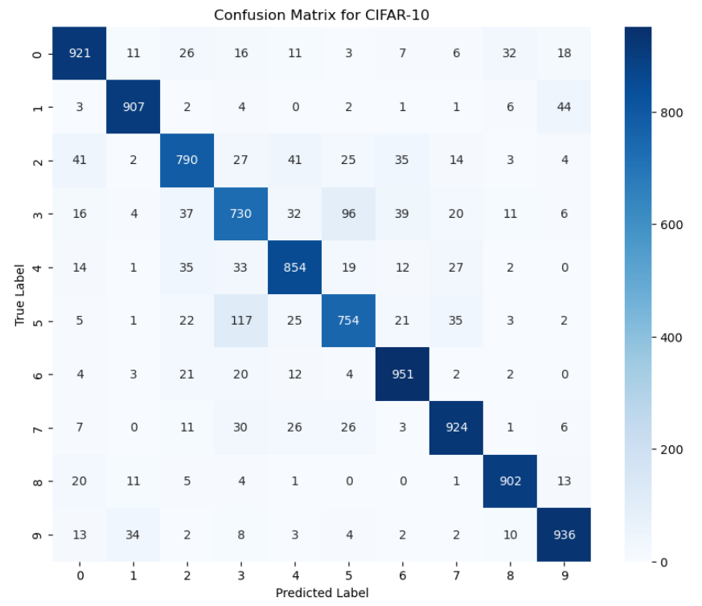
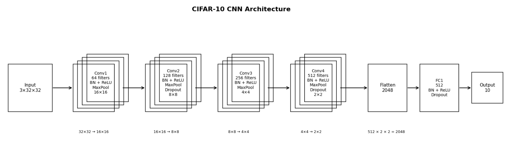

<h1>CNN Image Classification — MNIST → CIFAR-10</h1>

<h2>Project Overview</h2>

This project applies <strong>Convolutional Neural Networks (CNNs)</strong> to image classification tasks of increasing complexity using the <strong>MNIST</strong> and <strong>CIFAR-10</strong> datasets.

The objective is to demonstrate how model performance evolves from a simple dataset (MNIST) to a more complex dataset (CIFAR-10), and to analyze model behavior through evaluation metrics, confusion matrices, and error analysis.

<h2>Datasets</h2>

<h3>MNIST (Baseline)</h3>
<ul>
  <li>Grayscale images of handwritten digits (0–9)</li>
  <li>Image size: 28 × 28</li>
  <li>Low-complexity dataset with well-separated classes</li>
</ul>

<h3>CIFAR-10</h3>
<ul>
  <li>Color images across 10 classes: airplane, automobile, bird, cat, deer, dog, frog, horse, ship, and truck</li>
  <li>Image size: 32 × 32</li>
  <li>Higher complexity with overlapping visual features across classes</li>
</ul>

<h2>CNN Model Architecture</h2>

The final CIFAR-10 model is a <strong>deep Convolutional Neural Network (CNN)</strong> designed to classify 32 × 32 RGB images into 10 categories.

<ul>
  <li><strong>Input:</strong> 3 × 32 × 32 RGB images</li>

  <li><strong>Convolutional Block 1:</strong>
    <ul>
      <li>64 filters, 3 × 3 kernel, padding = 1</li>
      <li>Batch Normalization + ReLU</li>
      <li>Max Pooling (2 × 2)</li>
    </ul>
  </li>

  <li><strong>Convolutional Block 2:</strong>
    <ul>
      <li>128 filters, 3 × 3 kernel, padding = 1</li>
      <li>Batch Normalization + ReLU</li>
      <li>Max Pooling (2 × 2)</li>
      <li>Dropout (p = 0.1)</li>
    </ul>
  </li>

  <li><strong>Convolutional Block 3:</strong>
    <ul>
      <li>256 filters, 3 × 3 kernel, padding = 1</li>
      <li>Batch Normalization + ReLU</li>
      <li>Max Pooling (2 × 2)</li>
    </ul>
  </li>

  <li><strong>Convolutional Block 4:</strong>
    <ul>
      <li>512 filters, 3 × 3 kernel, padding = 1</li>
      <li>Batch Normalization + ReLU</li>
      <li>Max Pooling (2 × 2)</li>
      <li>Dropout (p = 0.1)</li>
    </ul>
  </li>

  <li><strong>Fully Connected Layer:</strong>
    <ul>
      <li>2048 input features → 512 neurons</li>
      <li>Batch Normalization + ReLU</li>
      <li>Dropout (p = 0.3)</li>
    </ul>
  </li>

  <li><strong>Output Layer:</strong> 10 neurons (one per class)</li>
</ul>

The model uses <strong>ReLU activations</strong>, <strong>batch normalization</strong> to stabilize training, <strong>max pooling</strong> to reduce spatial dimensions while preserving key features, and <strong>dropout</strong> to help reduce overfitting.

<h2>Hyperparameters and Optimization</h2>

<ul>
  <li><strong>Learning rate:</strong> 0.001</li>
  <li><strong>Batch size:</strong> 64</li>
  <li><strong>Epochs:</strong> 30</li>
  <li><strong>Optimizer:</strong> Adam</li>
  <li><strong>Weight decay:</strong> 1e-4</li>
  <li><strong>Learning rate scheduler:</strong> StepLR</li>
  <li><strong>Data augmentation:</strong> random horizontal flipping, random cropping, and normalization</li>
</ul>

<h2>Methods</h2>

<ul>
  <li>Data preprocessing and normalization</li>
  <li>Model training and validation</li>
  <li>Performance evaluation using accuracy</li>
  <li>Confusion matrix analysis for class-level performance</li>
  <li>Error analysis to understand misclassifications</li>
</ul>

<h2>Results</h2>

<h3>MNIST</h3>
<ul>
  <li>High classification accuracy (~99%)</li>
  <li>Minimal misclassification</li>
  <li>Serves as a baseline model</li>
</ul>

<h3>CIFAR-10</h3>
<ul>
  <li>Achieved strong performance (~86% test accuracy) using a custom CNN architecture</li>
  <li>Increased difficulty due to low resolution and class similarity</li>
  <li>Greater variability in predictions across classes</li>
</ul>

<h2>Confusion Matrix Insights</h2>

To interpret the confusion matrix, the CIFAR-10 class labels are encoded as:
0 (airplane), 1 (automobile), 2 (bird), 3 (cat), 4 (deer), 5 (dog), 6 (frog), 7 (horse), 8 (ship), and 9 (truck).

<ul>
  <li>The most significant misclassification occurs between <strong>cats and dogs</strong>, reflecting their similar visual features.</li>
  <li>The model struggles with the <strong>bird</strong> class, often confusing it with airplane and deer.</li>
  <li>These errors suggest difficulty capturing subtle textures and shapes in low-resolution images.</li>
</ul>

<h2>MNIST vs CIFAR-10 Comparison</h2>

<table>
  <tr>
    <th>Aspect</th>
    <th>MNIST</th>
    <th>CIFAR-10</th>
  </tr>
  <tr>
    <td>Complexity</td>
    <td>Low</td>
    <td>High</td>
  </tr>
  <tr>
    <td>Accuracy</td>
    <td>~99%</td>
    <td>~70–80%</td>
  </tr>
  <tr>
    <td>Main Challenge</td>
    <td>Minimal class overlap</td>
    <td>Low resolution and similar classes</td>
  </tr>
</table>

<h2>Project Visuals</h2>

<h3>Confusion Matrix</h3>

  

<h3>Model Architecture</h3>

  

<h2>Future Improvements</h2>

<ul>
  <li>Refine data augmentation to preserve important visual features</li>
  <li>Experiment with deeper CNN architectures</li>
  <li>Apply transfer learning with pretrained models</li>
  <li>Explore transformer-based models for improved performance</li>
</ul>

<h2>Technologies Used</h2>

Python • PyTorch • NumPy • Matplotlib • Seaborn • Jupyter Notebook

<h2>Repository Structure</h2>

<pre>
├── mnist_cnn.ipynb
├── cifar10_cnn.ipynb
├── figures/
│   ├── confusion_matrix.png
│   ├── model_architecture.png
└── README.md
</pre>

<h2>Key Takeaways</h2>

<ul>
  <li>CNNs perform extremely well on simple datasets such as MNIST.</li>
  <li>Performance decreases as dataset complexity increases.</li>
  <li>Confusion matrix analysis provides deeper insight beyond accuracy.</li>
  <li>Dataset complexity significantly impacts model performance.</li>
</ul>

<h2>License</h2>

This project is licensed under the MIT License.

